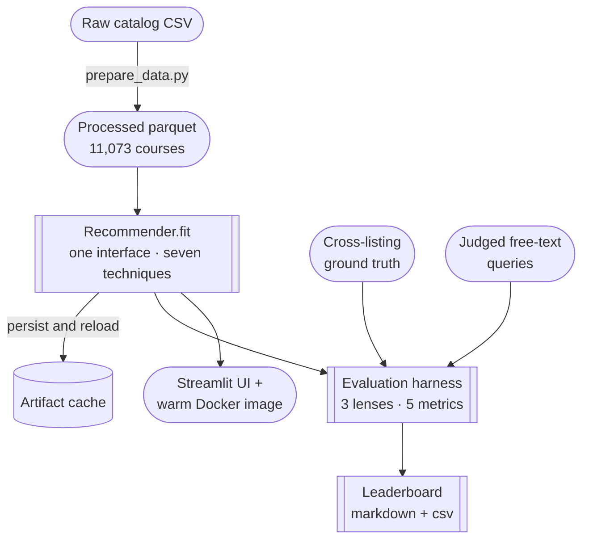

# Architecture

The whole system is organized around a single idea: **if every technique implements
the same interface, one harness can score them all and one leaderboard can rank them.**
Everything else — the data pipeline, the artifact cache, the eval lenses, the UI —
hangs off that contract.

The same picture three ways — a diagram, a plain-language walkthrough, and a table of
the techniques. Read whichever suits you.



**The pipeline in five steps:**

1. **Clean the data.** `prepare_data.py` turns the raw UC Berkeley catalog CSV into a
   model-ready parquet of **11,073 courses** ([see The Data](data.md)).
2. **Fit every technique through one interface.** All seven technique families implement
   the same `Recommender.fit()` contract, so nothing downstream needs to know which is which.
3. **Cache the fitted models.** Embeddings, indexes, and vectors persist to disk and
   reload on the next run — nothing expensive is recomputed.
4. **Score them all the same way.** One evaluation harness ranks every technique through
   three lenses, using the cross-listing ground truth and a set of judged free-text queries.
5. **Rank and explore.** The harness writes a leaderboard; the same fitted techniques also
   power an interactive Streamlit UI and a ready-to-run Docker image.

**The seven technique families** — each is built from primitives in its own notebook:

| Family | In one line | Build it in |
|---|---|---|
| **Lexical** | TF-IDF and BM25 over the term–document matrix — the honest baseline. | [Notebook 01](notebooks/01_lexical.ipynb) |
| **Topic models** | LSA, NMF, LDA — compress the term space to latent topics. | [Notebook 02](notebooks/02_topics.ipynb) |
| **SBERT** | Sentence-embedding vectors (MiniLM, MPNet) — the overall winner. | [Notebook 03](notebooks/03_embeddings.ipynb) |
| **Rerank + MMR** | A cross-encoder reranks SBERT candidates, with a diversity knob. | [Notebook 04](notebooks/04_rerank.ipynb) |
| **Metadata fusion** | Fuse subject/level/units with text — and watch it *hurt*. | [Notebook 05](notebooks/05_metadata.ipynb) |
| **Graph (PPR)** | Personalized PageRank on a leak-safe held-out edge split. | [Notebook 06](notebooks/06_graph.ipynb) |
| **LLM** | Local Ollama for tags, zero-shot rerank, and explanations. | [Notebook 08](notebooks/08_llm.ipynb) |

## The contract

Every technique subclasses [`Recommender`](https://github.com/sandeep-jay/course-recommender-lab/blob/main/src/courserec/interfaces.py)
(`src/courserec/interfaces.py`), sets a unique `name` (its leaderboard key) and a
`config` dict (its hyperparameters, logged with results), and implements three methods:

```python
class Recommender(ABC):
    name: str
    config: dict

    def fit(self, courses: pd.DataFrame) -> None: ...
    def recommend_similar(self, course_id: str, k: int = 10) -> list[Rec]: ...
    def recommend_by_text(self, query: str, k: int = 10) -> list[Rec]: ...
```

Both `recommend_*` methods return `list[Rec]` — a `(course_id, score)` pair — sorted by
descending score, length ≤ `k`. An item-to-item-only technique may raise
`NotImplementedError` from `recommend_by_text`, but must never return garbage.

Three **hard rules** are enforced by a shared contract test that every technique must
pass:

1. **Exclude the seed.** `recommend_similar` must never return the seed course itself.
2. **No leakage.** No technique may read `Cross-Listed Course(s)` as an input feature —
   it's the evaluation ground truth. The graph is the *sole* exception and must evaluate
   only on a held-out edge split.
3. **Sparse-text fallback.** Some courses have a one-word or missing description; a
   technique falls back to the title and never crashes on empty text.

## The data pipeline

`scripts/prepare_data.py` turns the raw catalog CSV into a model-ready parquet:

- Replaces the catalog's `"-"` **null token** with real NA (never treats `"-"` as data).
- Synthesizes a stable `course_id` as `f"{Subject} {Course Number}"` (e.g. `AEROENG 1`).
- Parses a course level, drops dead columns, and builds the combined text field with a
  **title fallback** for sparse descriptions.
- Parses with pandas (never line-based) — descriptions contain RFC-4180 quoted newlines.

The cleaned catalog is **11,073 unique courses**. See
[ADR-0001](adr/0001-duplicate-course-ids.md) for the duplicate-id handling.

## Artifacts & reproducibility

Fitted models, embedding caches, and ANN indexes persist to `artifacts/<name>/` and
load if present — embeddings are **never recomputed** every run. The embedding cache key
is `sha1(model_name + normalized_text)`. Every stochastic step uses the global
`RANDOM_SEED = 42`. `artifacts/` is gitignored.

API-backed techniques (a hosted embedding backend, the LLM technique) **degrade gracefully**
when no key or daemon is present — they skip and note it, never hard-failing the suite.
The repo runs end-to-end **with no API key**.

## The evaluation harness

`src/courserec/eval.py` scores every technique the same way, through **three lenses** —
because no single lens is trustworthy alone ([ADR-0002](adr/0002-eval-harness-design.md),
[ADR-0003](adr/0003-judged-query-lens.md)):

| Lens | Role | Caveat |
|---|---|---|
| **Cross-listing pairs** | Primary, automatic. Twins should rank each other near the top. | Near-identical text makes this easy for *any* method — validates correctness more than quality. |
| **Same-subject coherence** | A sanity floor only. | Never optimized for — a same-subject-only model scores high while being useless. |
| **Judged text-query set** | The only way to evaluate `recommend_by_text` (44 hand-labeled paraphrase-extreme queries). | Small; flagged as a gap if skipped, never silently omitted. |

**Metrics.** Recall@k, Precision@k, MRR, MAP, and NDCG@k for k ∈ {5, 10, 20}, plus
catalog coverage, intra-list diversity, and novelty. Because the ground-truth set is
small, the harness reports **bootstrap confidence intervals** on the primary metric
(NDCG@10) — and a winner is **never** crowned on a sub-CI gap.

**Leakage discipline.** When cross-listings are the target, no model uses that column as
a feature. The graph model is evaluated *only* on a held-out split of cross-listing
edges ([ADR-0006](adr/0006-graph-heldout.md)).

## The leaderboard

`scripts/run_eval.py` writes `results/leaderboard.{md,csv}` (plus `_text` and
`_heldout` variants): one row per technique×config with all metrics, fit time, query
latency, and API cost if any. It's sorted by NDCG@10 and **regenerable in one command** —
never hand-edited.

## Surfaces on top of the contract

Because every technique looks identical to the harness, the same set powers two more
surfaces with no special-casing:

- **Streamlit UI** ([ADR-0012](adr/0012-streamlit-ui.md)) — Explore, Compare,
  Leaderboard, and an interactive 2-D Map, over a fast offline subset of techniques.
- **Warm Docker image** ([ADR-0013](adr/0013-deploy-warm-docker-image.md)) — the UI with
  catalog, artifacts, and MiniLM weights baked in, CPU-only, no first-load encode.
